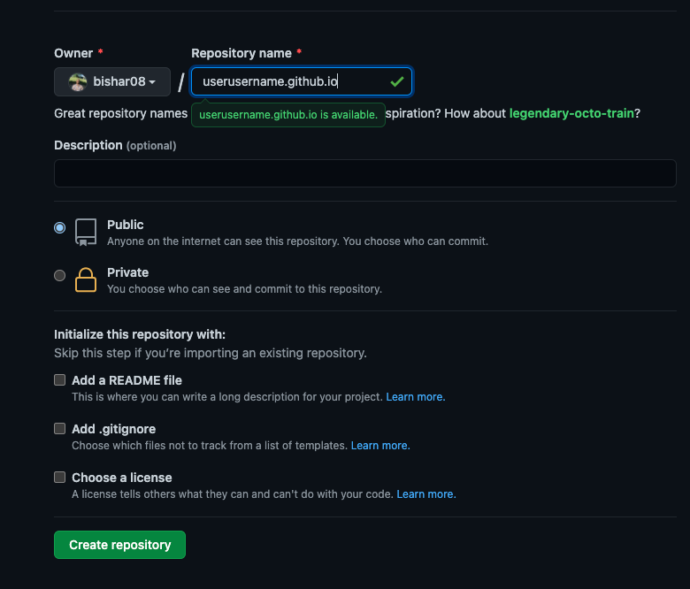
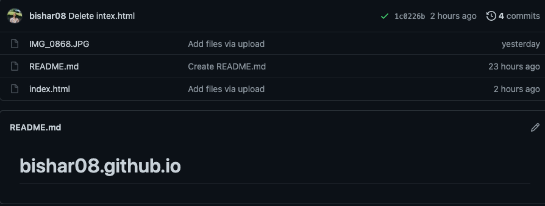

# How to create a web page in Github

1. create an account in Github from the website https://github.com/

You will need to sign up, and that is how it looks

 

Now create the account

2. Create a new repository

3. You will need to add the file you want in this repository by either from the terminal or the using drag and drop.

